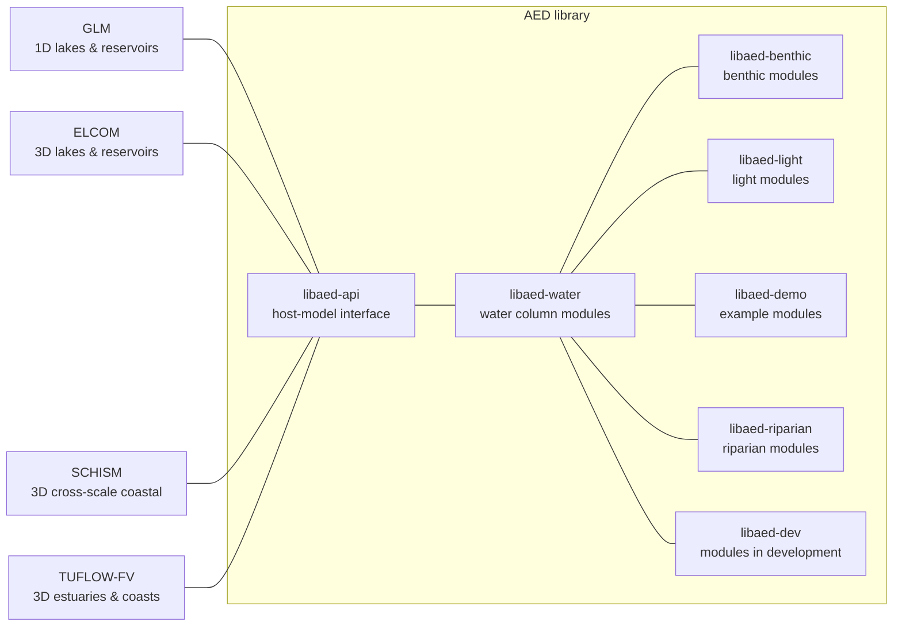

**Open-source simulation of aquatic ecosystems — water quality, biogeochemistry, and ecology.**

[Website](https://aquatic.science.uwa.edu.au) ·
[AED Science Manual](https://aquaticecodynamics.github.io/aed-science/) ·
[Releases](https://github.com/AquaticEcoDynamics/releases)

---

This is a page for the Aquatic EcoDynamics research group and associated collaboration network. The organisation hosts the **AED model** — a modular library for simulating water quality and aquatic ecosystem dynamics — together with its couplings to hydrodynamic host models, the **AED Toolkit** of supporting software, and repositories from our research and application projects. The AED code is led by researchers at The University of Western Australia and supported by contributions from a global community of researchers and practitioners. The code is released under GPL-3.0 unless noted otherwise.

Alongside the model suite, this organisation hosts repositories from our research projects — estuary and lake studies, teaching materials, dashboards and site-specific model applications. These are working repositories and vary in maturity; the maintained entry points for the models are the repositories listed above.

The AED model itself is a library of organised Fortran code repositories for aquatic biogeochemistry and ecodynamics: oxygen, carbon, nitrogen, phosphorus, organic matter, phytoplankton, zooplankton, pathogens, geochemistry, sediment diagenesis, macrophytes, bivalves and habitat, among others. AED does not compute hydrodynamics itself — it links to a host hydrodynamic model through a defined interface. The same water quality configuration can therefore be moved between various host models:

A summary of the main models are listed below 

| Coupled model | Host hydrodynamics | Typical use | Entry repository |
|---|---|---|---|
| **GLM-AED** |  &nbsp;[GLM](https://github.com/AquaticEcoDynamics/GLM) (1D) | Lakes, reservoirs, ponds, wetlands | [`glm-aed`](https://github.com/AquaticEcoDynamics/glm-aed) |
| **FV-AED** |  &nbsp;[TUFLOW-FV](https://www.tuflow.com/products/tuflow-fv/) (3D finite volume) | Estuaries, coasts, rivers, floodplains | [`fv-aed`](https://github.com/AquaticEcoDynamics/fv-aed) |
| **ELCOM-AED** |  &nbsp;ELCOM (3D structured) | Stratified lakes, reservoirs and coasts | `elcom-aed` |
| **SCHISM-AED** |  &nbsp;[SCHISM](https://github.com/schism-dev/schism) (3D unstructured) | Cross-scale river–estuary–ocean systems | `schism-aed` |

🌏 <a href="https://aquatic.science.uwa.edu.au">aquatic.science.uwa.edu.au</a>

